# Gift Freak

## Background

The problem when you buy a gift certificate in a shop is that once you pay for it the shop owner already has the money but you are not sure he will honor the agreement and actually let you purchase items according to the value of the certificate. The shop could also go out of business and you would lose the value of the certificate. And all this without the shop vesting any money in this setup.

What this `ERC721` token seeks to solve is that a shop owner only receives the money once you spend the certificate. It also includes a functionality for the shop owner or promoter to give the customer a discount or rather a bonus value on top of the purchase price. For example a City could fund this Token with a 10% bonus so that a customer who purchased a gift certificate of 100 USD would actually be able to spend 110 USD at a approved shop in the city.

The contract implements a whitelist to allow only shops to redeem the Gift Certificates. As redeeming them gets you a 10% bonus, we don't want everyone to be able to redeem their own Gift Certificates and get free money. The whitelist is maintained by the owner of the ERC721 contract. Shop owners can renounce their 'membership'.

Things still to be added:
- implement a validity period for each certificate. This time period would allow a customer to redeem the certificate without the bonus for instance in the case there are not enough participating shops anymore.
- find some way so that shop owners cannot buy GiftCertifcates and redeem them, which is basically free money.

## install

Clone the git repository

```bash
git clone https://github.com/ammarbrohi/sonavy-market
cd sonavy-market
```

## test
These test have been written for Truffle v5 (web3 v1.0.0) which uses BN whereas Truffle v4 (web3 0.20.x) used BigNumber. Therefor these test will fail if you use Truffle v4. Please use Truffle v5

You can see the version of your Truffle installation like this
```bash
npm list -g truffle
/home/coninxd/.nvm/versions/node/v11.6.0/lib
└── truffle@5.0.0

```
To uninstall Truffle v5 and reinstall v4:
```bash
npm remove -g truffle
npm install -g truffle
```
Note: if you're having problems with (sudo related) access rights regarding npm I highly recommend [this guide](https://www.nearform.com/blog/how-to-manage-node-js-sudo-free-with-nvm/)

Also there is an [issue](https://github.com/ethereum/web3.js/issues/1916) with web3 1.0.0-beta.37 and certain events. We use the latest OpenZeppelin v2.1.0 beta2 and have modified the ERC20.sol removing all the emits as a workaround until the issue is resolved.

Run truffle develop and run the tests
```bash
truffle develop
truffle(develop)> test
Using network 'develop'.

Compiling ./../../sonavy-market/contracts/GiftCertificate.sol...
Compiling ./../../sonavy-market/contracts/StableToken.sol...
Compiling ./contracts/GiftCertificate.sol...
Compiling ./contracts/Migrations.sol...
Compiling ./contracts/StableToken.sol...
Compiling openzeppelin-solidity/contracts/access/Roles.sol...
Compiling openzeppelin-solidity/contracts/access/roles/PauserRole.sol...
Compiling openzeppelin-solidity/contracts/drafts/Counter.sol...
Compiling openzeppelin-solidity/contracts/introspection/ERC165.sol...
Compiling openzeppelin-solidity/contracts/introspection/IERC165.sol...
Compiling openzeppelin-solidity/contracts/lifecycle/Pausable.sol...
Compiling openzeppelin-solidity/contracts/math/SafeMath.sol...
Compiling openzeppelin-solidity/contracts/ownership/Ownable.sol...
Compiling openzeppelin-solidity/contracts/token/ERC20/ERC20.sol...
Compiling openzeppelin-solidity/contracts/token/ERC20/ERC20Detailed.sol...
Compiling openzeppelin-solidity/contracts/token/ERC20/IERC20.sol...
Compiling openzeppelin-solidity/contracts/token/ERC721/ERC721.sol...
Compiling openzeppelin-solidity/contracts/token/ERC721/ERC721Enumerable.sol...
Compiling openzeppelin-solidity/contracts/token/ERC721/ERC721Full.sol...
Compiling openzeppelin-solidity/contracts/token/ERC721/ERC721Metadata.sol...
Compiling openzeppelin-solidity/contracts/token/ERC721/ERC721Pausable.sol...
Compiling openzeppelin-solidity/contracts/token/ERC721/IERC721.sol...
Compiling openzeppelin-solidity/contracts/token/ERC721/IERC721Enumerable.sol...
Compiling openzeppelin-solidity/contracts/token/ERC721/IERC721Metadata.sol...
Compiling openzeppelin-solidity/contracts/token/ERC721/IERC721Receiver.sol...
Compiling openzeppelin-solidity/contracts/utils/Address.sol...

Compilation warnings encountered:

openzeppelin-solidity/contracts/drafts/Counter.sol:17:3: Warning: This declaration shadows an existing declaration.
  struct Counter {
  ^ (Relevant source part starts here and spans across multiple lines).
openzeppelin-solidity/contracts/drafts/Counter.sol:15:1: The shadowed declaration is here:
library Counter {
^ (Relevant source part starts here and spans across multiple lines).

Contract: StableToken
  ✓ TotalSupply of STBL at the start should be 0
  ✓ owner prints some STBL (138ms)
  ✓ Alice prints some STBL (119ms)
  ✓ TotalSupply of STBL should be 200 (42ms)
  ✓ Alice sends owner's STBL to Bob (497ms)

Contract: GiftCertificate
  ✓ print some STBL fior participants (224ms)
  ✓ Owner funds GFT with STBL (206ms)
  ✓ Alice buys some GFT (367ms)
  ✓ Alice spends GFT with Bob (296ms)
  ✓ Bob redeems GFT (349ms)
  ✓ Pause contract and redeem (866ms)


11 passing (4s)

truffle(development)>

```
Note: the Warnings are native to the OpenZeppelin libraries used.

## front end interface (development server)
Install ganache-cli
```bash
npm install -g ganache-cli
```

Run ganache-cli:
```bash
ganache-cli
```
and import the BIP39 mnemonic in MetaMask. Make sure you are connected to ganache/localhost:8548.

Start the truffle console, compile and migrate the contracts
```bash
$ truffle console
truffle(development)> compile
Compiling ./contracts/GiftCertificate.sol...
Compiling ./contracts/Migrations.sol...
Compiling ./contracts/ShopRole.sol...
Compiling ./contracts/StableToken.sol...
Compiling openzeppelin-solidity/contracts/access/Roles.sol...
Compiling openzeppelin-solidity/contracts/access/roles/PauserRole.sol...
Compiling openzeppelin-solidity/contracts/drafts/Counter.sol...
Compiling openzeppelin-solidity/contracts/introspection/ERC165.sol...
Compiling openzeppelin-solidity/contracts/introspection/IERC165.sol...
Compiling openzeppelin-solidity/contracts/lifecycle/Pausable.sol...
Compiling openzeppelin-solidity/contracts/math/SafeMath.sol...
Compiling openzeppelin-solidity/contracts/ownership/Ownable.sol...
Compiling openzeppelin-solidity/contracts/token/ERC20/ERC20.sol...
Compiling openzeppelin-solidity/contracts/token/ERC20/ERC20Detailed.sol...
Compiling openzeppelin-solidity/contracts/token/ERC20/IERC20.sol...
Compiling openzeppelin-solidity/contracts/token/ERC721/ERC721.sol...
Compiling openzeppelin-solidity/contracts/token/ERC721/ERC721Enumerable.sol...
Compiling openzeppelin-solidity/contracts/token/ERC721/ERC721Full.sol...
Compiling openzeppelin-solidity/contracts/token/ERC721/ERC721Metadata.sol...
Compiling openzeppelin-solidity/contracts/token/ERC721/ERC721Pausable.sol...
Compiling openzeppelin-solidity/contracts/token/ERC721/IERC721.sol...
Compiling openzeppelin-solidity/contracts/token/ERC721/IERC721Enumerable.sol...
Compiling openzeppelin-solidity/contracts/token/ERC721/IERC721Metadata.sol...
Compiling openzeppelin-solidity/contracts/token/ERC721/IERC721Receiver.sol...
Compiling openzeppelin-solidity/contracts/utils/Address.sol...

Compilation warnings encountered:

openzeppelin-solidity/contracts/drafts/Counter.sol:16:5: Warning: This declaration shadows an existing declaration.
    struct Counter {
    ^ (Relevant source part starts here and spans across multiple lines).
openzeppelin-solidity/contracts/drafts/Counter.sol:15:1: The shadowed declaration is here:
library Counter {
^ (Relevant source part starts here and spans across multiple lines).


Writing artifacts to ./build/contracts

truffle(development)> migrate
⚠️  Important ⚠️
If you're using an HDWalletProvider, it must be Web3 1.0 enabled or your migration will hang.


Starting migrations...
======================
> Network name:    'development'
> Network id:      1546772508299
> Block gas limit: 6721975


1_initial_migration.js
======================

   Deploying 'Migrations'
   ----------------------
   > transaction hash:    0x1a520c71b242ace19db8e1e5655b623461f3c4c498aa3cf15bd5801387cfcab6
   > Blocks: 0            Seconds: 0
   > contract address:    0xdE6C7a9AD90B52200Ab06007453850DFCEEc14eb
   > account:             0x5a187032509EAFE534f673c8FC073Fb1791e776B
   > balance:             99.99430184
   > gas used:            284908
   > gas price:           20 gwei
   > value sent:          0 ETH
   > total cost:          0.00569816 ETH


   > Saving migration to chain.
   > Saving artifacts
   -------------------------------------
   > Total cost:          0.00569816 ETH


2_StableToken_migration.js
==========================

   Deploying 'StableToken'
   -----------------------
   > transaction hash:    0xa4c3036f0dd48c041a2ffa95d409ebb8452d7576e0203ac64c8443b39906b046
   > Blocks: 0            Seconds: 0
   > contract address:    0xc185312fF7Eae30847db153A8308Ec9B6Cc41AEd
   > account:             0x5a187032509EAFE534f673c8FC073Fb1791e776B
   > balance:             99.96909986
   > gas used:            1218065
   > gas price:           20 gwei
   > value sent:          0 ETH
   > total cost:          0.0243613 ETH


   > Saving migration to chain.
   > Saving artifacts
   -------------------------------------
   > Total cost:           0.0243613 ETH


3_GiftCertificate_migration.js
==============================

   Deploying 'GiftCertificate'
   ---------------------------
   > transaction hash:    0x1b5d55246360cb31c86c74a797b33ecf23d92dac8f3e55cdc4659e65cd0b27c1
   > Blocks: 0            Seconds: 0
   > contract address:    0x54Fb901655071603cc7b66088E3e68BE1ccC03AD
   > account:             0x5a187032509EAFE534f673c8FC073Fb1791e776B
   > balance:             99.87633352
   > gas used:            4611283
   > gas price:           20 gwei
   > value sent:          0 ETH
   > total cost:          0.09222566 ETH


   > Saving migration to chain.
   > Saving artifacts
   -------------------------------------
   > Total cost:          0.09222566 ETH


Summary
=======
> Total deployments:   3
> Final cost:          0.12228512 ETH

truffle(development)>

```


The provided front end is a React application.
Depending on the current state of your system you might need to install node-gyp
```bash
sudo apt install node-gyp
```

Then run
```bash
cd client
npm run start
```
This will open http://localhost:3000/ in your browser.
You should know see this screen (if you see 'User' instead of 'Owner', make sure MetaMask is using the BIP39 mnemonic given by ganache-cli and you have selected Account 1) :
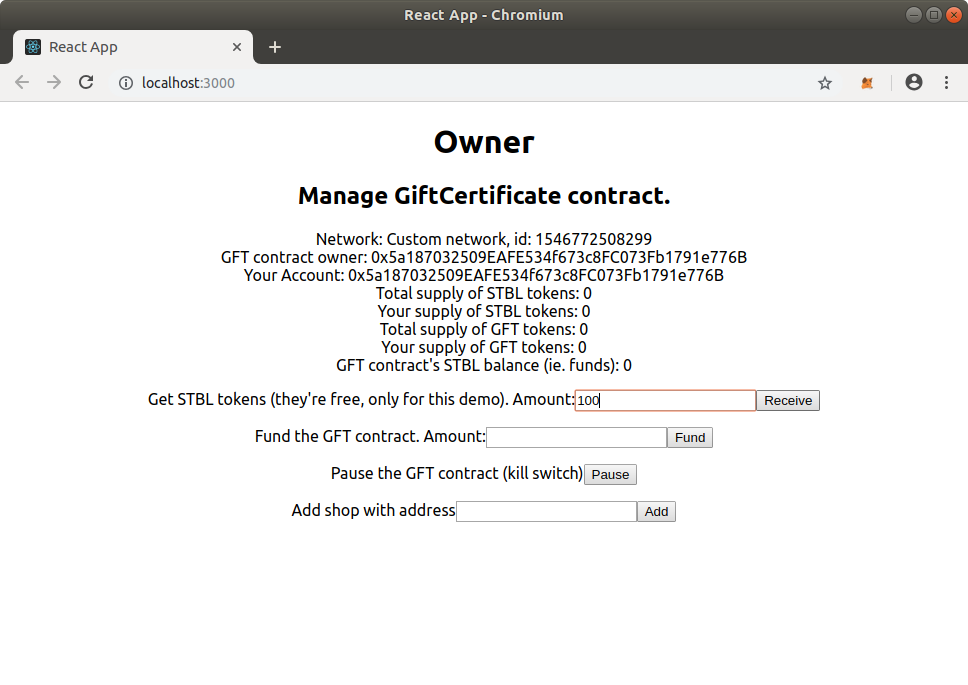

If you get a warning, stating 'Failed to load web3, accounts, or contract', make sure MetaMask is connected to Ganache/localhost:8545.

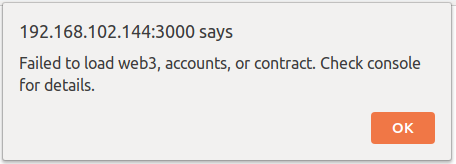'


First we need some stable coin. For this demo we have supplied our own ERC20 token (STBL), but in reality this would be DAI or some other ERC20 (stable) token.
Fill in 100 an click on Receive and confirm the transaction; this should increase your supply to 100.
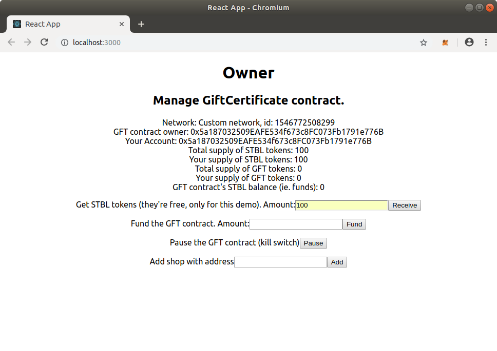

Then we will fund the contract so that anyone who buys a GiftCertificate will receive a 10% bonus (this percentage is determined during deployment of the contract). Fill in 100 for the ammount to fund and click Fund.
Note that you will see 2 transactions; one for approve() and one for transferFrom().
Your supply should of STBL tokens should now be 0 and the GFT contract should now have 100 STBL.
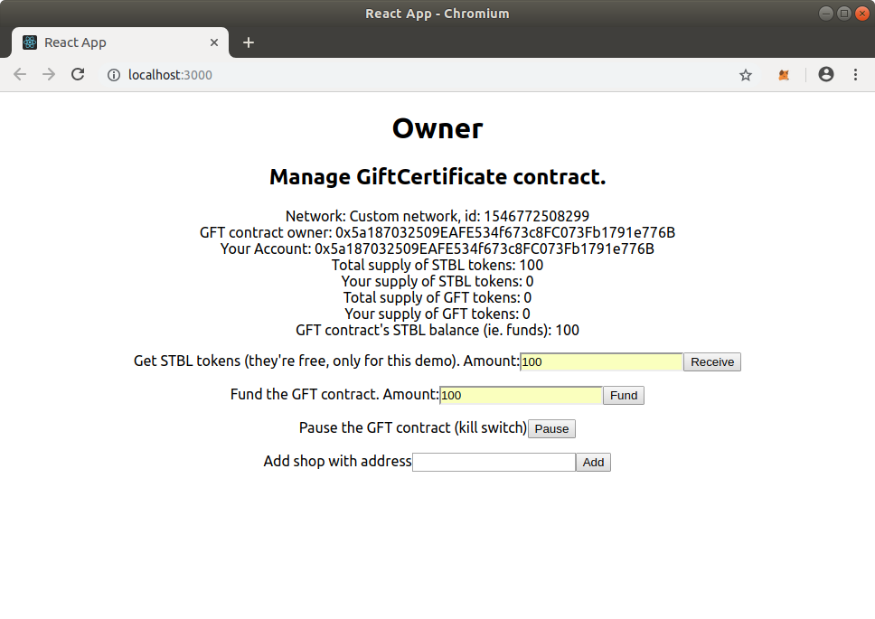

Now as owner of the GFT contract we need to add a shop.

By default MetaMask creates only 1 account. For further testing you will need 3 accounts, so create 2 new accounts:
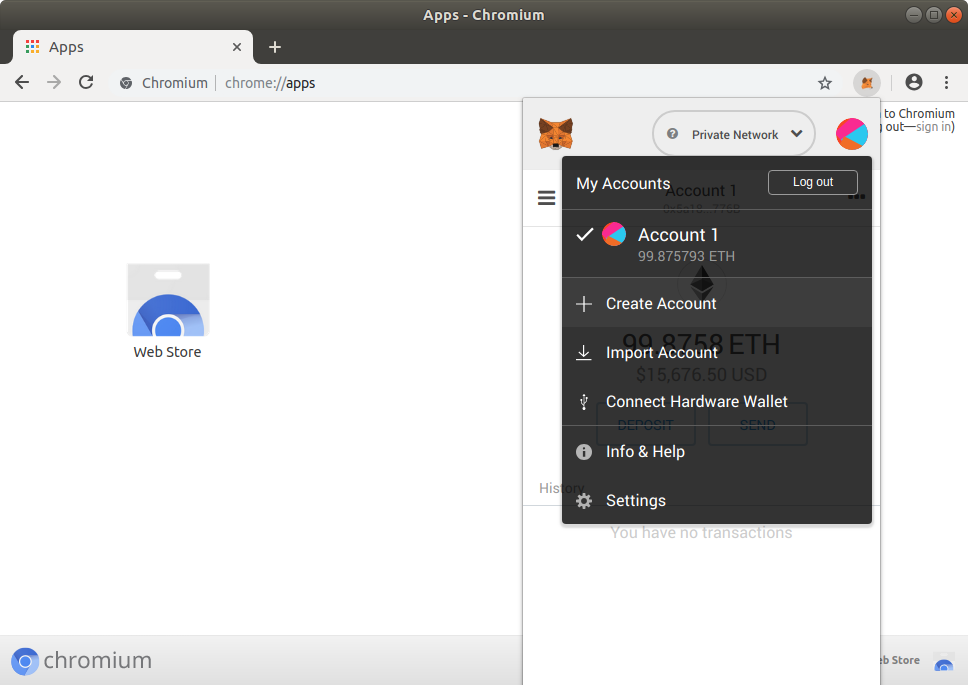

Then copy the address of Account 3 and as Account 1 (owner) add that address as a shop and confirm the transaction.
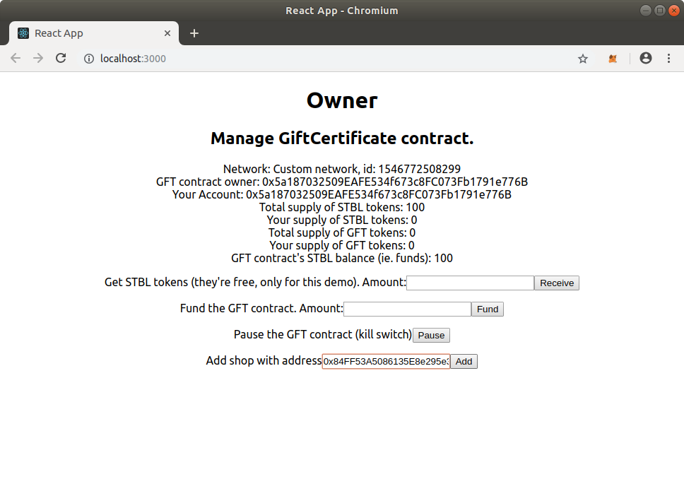

Now switch to Account 2. To buy a GiftCertificate we must first get some STBL tokens. Enter 100 in the amount, click Receive and confirm the transaction.
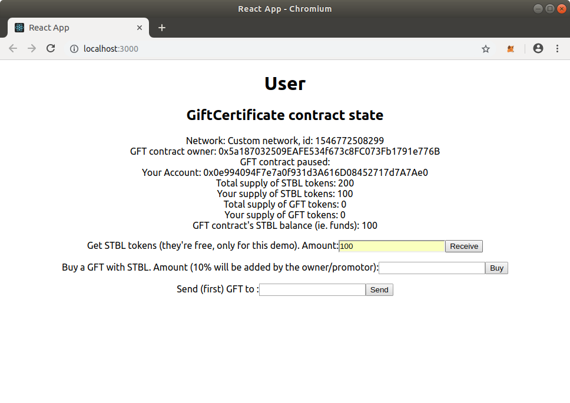

Fill in the amount you want to spend on the GiftCertificate (100 STBL), click on Buy and confirm the transactions. Again beacuse we use an aprove/transferFrom approach you will see 2 transactions.


Now we spend the GiftCertificate at the shop; fill in the address of Account 3 and click Send.
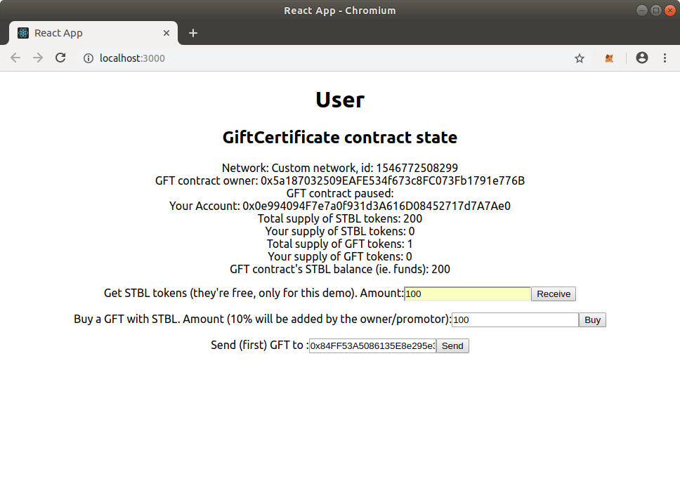


Note: When you send an ERC721 token with MetaMask, it shows as if it sending X ammount of ERC721 tokens where X is the unique ID of the ERC721 token. (see [issue 5145](https://github.com/MetaMask/metamask-extension/issues/5145) on MetaMask's github)

Now switch to Account 3 (the shop). Click on Redeem
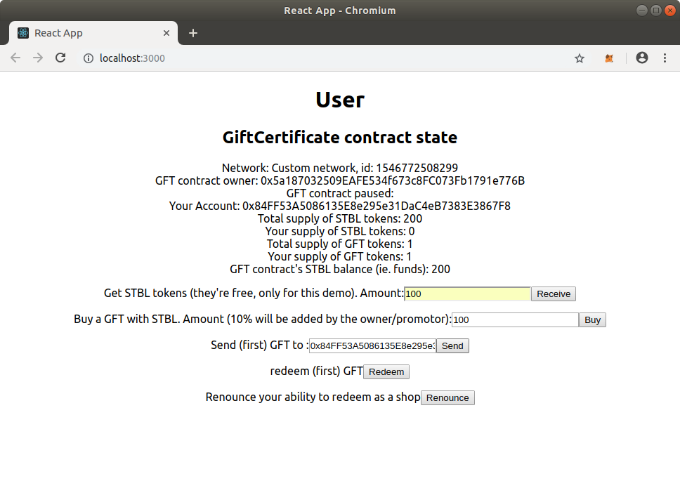

Your STBL balance should now be 110.
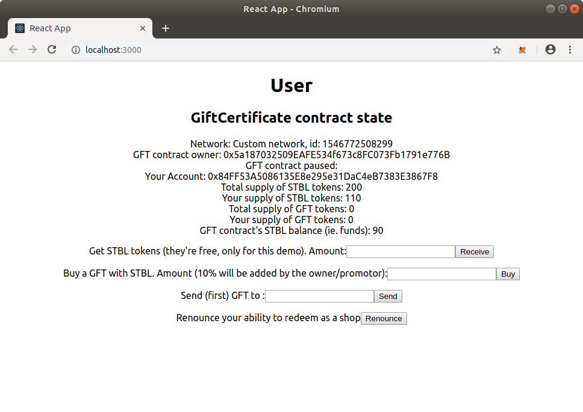

As a shop owner you can stop participating by renouncing the ability to redeem. To join again the owner has to add you again as a shop.

As precaution the contract has the ability to be paused  in case of emergencies.
To show this go back to a Account 2, get some more STBL and buy a GiftCertificate.
Then go back to Account 1 (the owner) and Pause the contract. Note that although the contract allows it the React app does not currently give you the ability to unpause the contract. So if that happens you will have to deploy again.)

In the paused state everyone can get their money back. The owner however must wait until all users have been refunded.
Switch to Account 2. Notice that now there is a redeem button which was not their for Account 2 in the unpaused state.
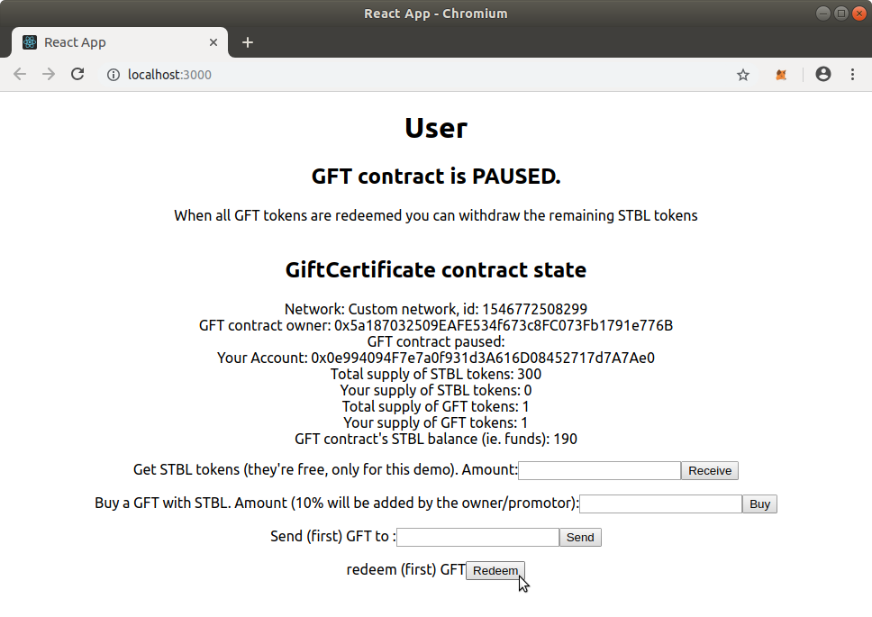

Your STBL balance should now be 110 (the bonus is refunded to you as it is not your fault the contract has been shutdown)
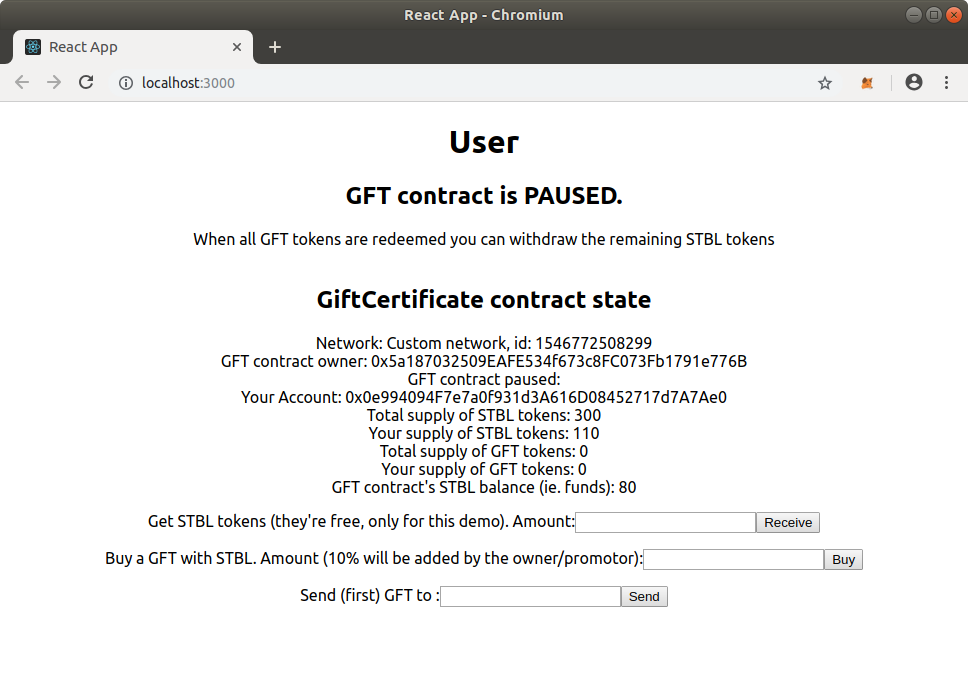
